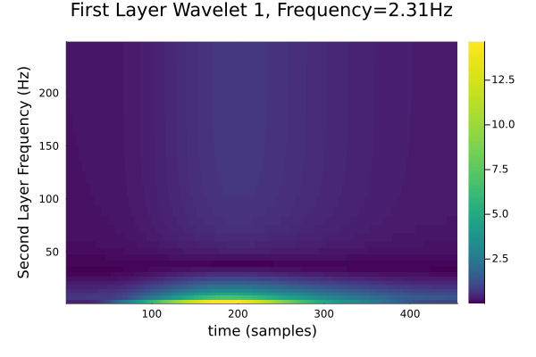
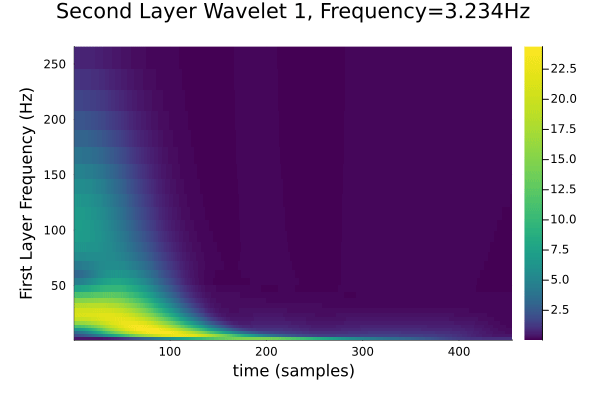

# ScatteringTransform.jl

A Julia implementation of the scattering transform, which provides a prestructured alternative to a convolutional neural network.
In a similar vein to a CNN, it alternates between continuous wavelet transforms, nonlinear function applications, and subsampling.
This library is end-to-end differentiable and runs on the GPU; there is a companion package, [ParallelScattering.jl](https://github.com/dsweber2/ParallelScattering.jl/) that runs on parallelized CPUs.

This is achieved by creating differentiable wavelet Fourier filters using [FourierFilterFlux](https://dsweber2.github.io/FourierFilterFlux.jl/dev/), which are then interspersed with Subsampling Operators modified from Flux.jl, and pointwise nonlinear functions (in practice, this means absolute value or ReLU).

For a comparable package in python, see [Kymatio](https://www.kymat.io/).

```@contents

```

## Basic Example

```@setup
using ScatteringTransform, Wavelets, Plots
```

As an example signal, let's work with a doppler signal:

```@example ex
using Wavelets, Plots
N = 2047
signal = testfunction(N, "Doppler")
plot(signal, legend=false, title="Doppler signal")
savefig("figures/rawDoppler.svg"); #hide
nothing # hide
```


First we need to make a `scatteringTransform` instance, which will create and store all of the necessary filters, subsampling operators, nonlinear functions, etc.
The parameters are described in the `scatteringTransform` type. The function `reshapeInputs` converts data matrices and vectors into a usable form and returns the reshaped array and its dimensions. It works for any shaped input signal. 
Since the Doppler signal is smooth, but with varying frequency, let's set the wavelet family `cw=Morlet(π)` specifies the mother wavelet to be a Morlet wavelet with mean frequency π, and frequency spacing `β=2`:

```@example ex
using ScatteringTransform, ContinuousWavelets
f, dims = reshapeInputs(signal)
St = scatteringTransform(dims, 2, cw=Morlet(π), β=2, σ=abs)
sf = St(f)
```

The results `sf` are stored in the `ScatteredOut` type; for a two layer scattering transform, it has three output matrices (zeroth, first and second layers).

### Zeroth Layer

The zeroth layer is simply a moving average of the original signal:

```@example ex
plotZerothLayer1D(sf)
```

### First Layer

The first layer is the average of the absolute value of the scalogram:

```@example ex
plotFirstLayer(sf, St)
```

With the plotting utilities included in this package, you are able to display the previous plot along with the original signal and the first layer wavelet gradients: 

```@example ex
plotFirstLayer1DAll(sf, f)
```


### Second Layer

The second layer is where the scattering transform begins to get more involved, and reflects both the frequency of [the envelope](https://en.wikipedia.org/wiki/Analytic_signal#Instantaneous_amplitude_and_phase) surrounding the signal and the frequency of the signal itself.
With our plotting utilities, you can display the second layer with respect to specified wavelet paths from the first and second layer. After specifying the `sf` and `St` for your plot, provide an array of the desired wavelets from the first layer and an array of the desired wavelets from the second layer. 
To this end, lets make two gifs, the first with the _first_ layer frequency varying with time:

```@example ex
plotSecondLayerFixAndVary(sf, St, 1:30, 1, fps=1, saveTo="figures/sliceByFirst.gif")
nothing # hide
```


By fixing the first layer frequency, we get the scalogram of a single line from the scalogram above.
As the first layer frequency increases, the energy concentrates to the beginning of the signal while the signal strength generally decreases.

The second has the _second_ layer frequency varying with time:

```@example ex
plotSecondLayerFixAndVary(sf, St, 1, 1:28, fps=1, saveTo="figures/sliceBySecond.gif")
nothing # hide
```


If desired, this package allows one to plot the results of a specific path. Here is an example, where we are plotting the resulting plot if we were to use first layer wavelet 3 and second layer wavelet 1. 

```@example ex
plotSecondLayerSpecificPath(sf, St, 3, 1, f)
```

For any fixed second layer frequency, we get approximately the curve in the first layer scalogram, with different portions emphasized, and the overall mass decreasing as the frequency increases, corresponding to the decreasing amplitude of the envelope for the doppler signal.
These plots can also be created using various plotting utilities defined in this package. 

For example, we can generate a denser representation with the `plotSecondLayer` function:

```@example ex
plotSecondLayer(sf, St)
```

where the frequencies are along the axes, the heatmap gives the largest value across time for that path, and at each path is a small plot of the averaged timecourse.


### Joint Plot

Finally, we can constuct a joint plot of much of our prior information. This plot will display the zeroth layer, first layer and second layer information for a given example. 

```@example ex
jointPlot(sf, "Scattering Transform", :viridis, St)
```
